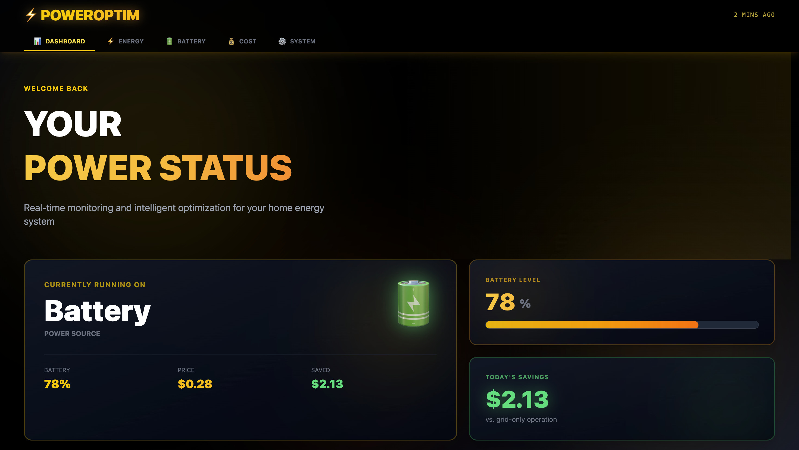

# ⚡ PowerOptim - Smart Home Energy Optimization System

> Senior Capstone Project - Computer Science 2025/2026 - Cleveland State University

A real-time energy monitoring and optimization system that intelligently manages power consumption between grid electricity and battery storage to minimize costs.



## 🎯 Project Overview

PowerOptim is a smart home energy management system that:
- Monitors real-time electricity pricing
- Automatically switches between grid power and battery storage
- Optimizes energy usage to reduce costs by up to 40%
- Provides real-time analytics through an intuitive web dashboard

## ✨ Features

- **Real-Time Monitoring** - Track energy usage, battery status, and electricity costs live
- **Smart Optimization** - AI-powered switching between grid and battery based on pricing
- **Cost Analytics** - Detailed breakdowns of savings and energy consumption
- **Battery Management** - Monitor battery health, cycles, and charging status
- **Responsive Dashboard** - Beautiful yellow/amber themed industrial design

## 🛠️ Tech Stack

### Frontend
- **Vue.js 3** - Progressive JavaScript framework
- **Tailwind CSS** - Utility-first CSS framework
- **Vite** - Fast build tool and dev server

### Backend
- **FastAPI** - Modern Python web framework
- **Uvicorn** - ASGI server

### Hardware
- **Raspberry Pi 4B** - Main controller
- **Python** - Hardware communication

## 📁 Project Structure

```
Senior_Design_2425/
├── frontend/           # Vue.js web application
│   ├── src/
│   │   ├── components/
│   │   ├── views/
│   │   └── App.vue
│   └── package.json
├── backend/            # FastAPI server
│   ├── models/         # Database models
│   ├── routes/         # API endpoints
│   ├── services/       # Business logic
│   ├── utils/          # Helper functions
│   ├── main.py         # Application entry point
│   └── requirements.txt
└── README.md           # This file
```

## 🚀 Quick Start

### Prerequisites

- **Node.js** (v18+)
- **Python** (v3.9+)
- **Git**

### 1. Clone the Repository

```bash
git clone https://github.com/YOUR_USERNAME/Senior_Design_2425.git
cd Senior_Design_2425
```

### 2. Backend Setup

```bash
# Navigate to backend
cd backend

# Create virtual environment
python3 -m venv venv

# Activate virtual environment (Mac/Linux)
source venv/bin/activate

# Install dependencies
pip install -r requirements.txt

# Run the server
uvicorn main:app --reload
```

Backend will be running at: `http://localhost:8000`

API documentation: `http://localhost:8000/docs`

### 3. Frontend Setup

Open a new terminal:

```bash
# Navigate to frontend
cd frontend

# Install dependencies
npm install

# Run development server
npm run dev
```

Frontend will be running at: `http://localhost:5173`

## 🎨 Screenshots

### Dashboard


### Energy Analytics


### Battery Status


*Note to team: We can add these images with real data later*

## 👥 Team Members

- **Spencer York**
- **Veer Gaudani**
- **Miguel Gallego Villegas**
- **Noe Cifuentes** 

## 📊 System Architecture

```
┌─────────────┐      ┌──────────────┐      ┌─────────────┐
│   Vue.js    │◄────►│   FastAPI    │◄────►│ Raspberry   │
│  Frontend   │      │   Backend    │      │     Pi      │
└─────────────┘      └──────────────┘      └─────────────┘
                            │
                            ▼
                     ┌──────────────┐
                     │   Database   │
                     └──────────────┘
```

## 🔌 API Endpoints

### Dashboard
- `GET /api/dashboard` - Get overview data
- `GET /api/status` - System health check

### Energy
- `GET /api/energy/hourly` - Hourly usage data
- `GET /api/energy/daily` - Daily usage data

### Battery
- `GET /api/battery` - Battery status and info

*NOT REAL! Just examples, will edit with real endpoints once project is complete*

## 🧪 Testing

### Backend Tests
```bash
cd backend
pytest
```

### Frontend Tests
```bash
cd frontend
npm run test
```
*Not implemented yet*

## 🔐 Environment Variables

Create a `.env` file in the backend directory:

```env
# Example - DO NOT commit this file!
DATABASE_URL=sqlite:///./poweroptim.db
SECRET_KEY=your-secret-key-here
API_KEY=your-api-key-here
```

See `.env.example` for all available options.

## 📝 Development Notes

### Git Workflow
1. Create feature branch: `git checkout -b feature/your-feature`
2. Make changes and commit: `git commit -m "Add feature"`
3. Push to GitHub: `git push origin feature/your-feature`
4. Create Pull Request on GitHub

### Code Style
- **Python**: Follow PEP 8
- **JavaScript**: ESLint configuration in frontend
- **Commits**: Use conventional commits (feat:, fix:, docs:, etc.)

## 🚧 Current Status

- [x] Project structure setup
- [x] Frontend dashboard design
- [x] Backend API framework
- [ ] Raspberry Pi integration
- [ ] Real-time data streaming
- [ ] User authentication
- [ ] Database implementation
- [ ] Testing suite
- [ ] Deployment

## 🤝 Contributing

1. Fork the repository
2. Create your feature branch
3. Commit your changes
4. Push to the branch
5. Open a Pull Request

## 📄 License

This project is part of a university capstone course and is for educational purposes.

## 🙏 Acknowledgments

- Course Instructor: Robert Fiske
- Advisor: Apostolos Kalatzis

## 📧 Contact

For questions or issues, please contact:
- Email: noecifuentes.technology@gmail.com
- GitHub Issues: [GitHub Issues](https://github.com/features/issues)

---

**PowerOptim** - *Optimizing Energy, Powering the Future* ⚡
